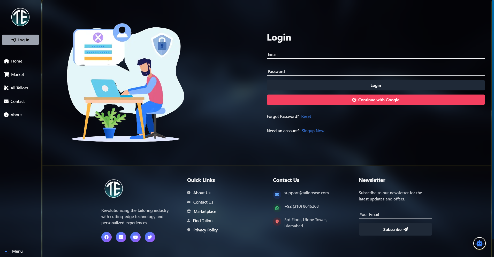
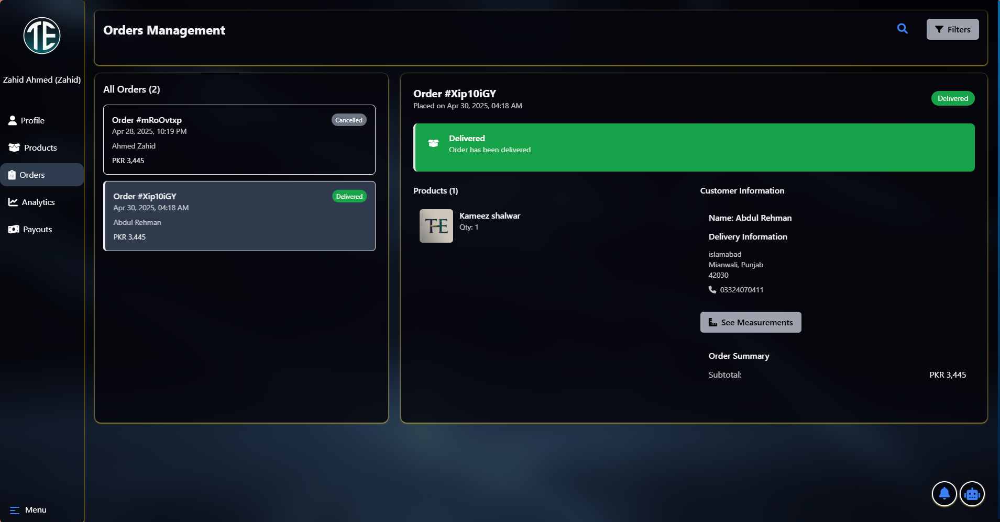
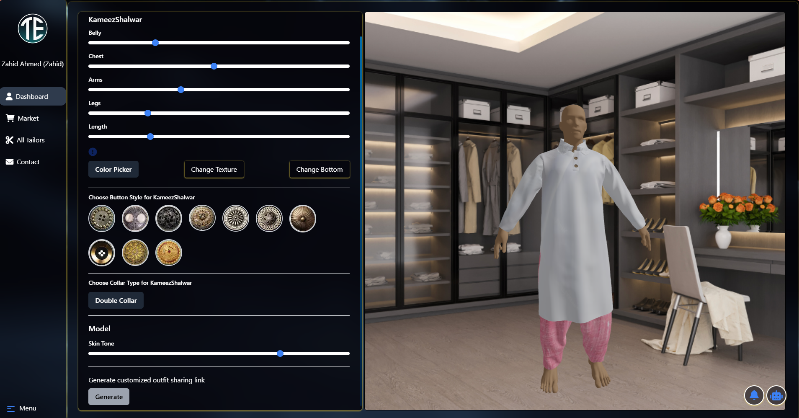
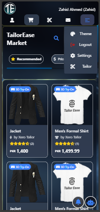

# 👔 TailorEase - Modern Tailoring Platform

TailorEase is a next-generation web platform that blends traditional tailoring with digital convenience. With 3D visualization, personalized recommendations, and seamless tailor-customer collaboration, TailorEase empowers both users and tailors to take control of custom fashion like never before.

---

## ✨ Features

- 🔒 Secure user and tailor accounts with smooth onboarding
- 📏 3D body measurement visualization and customization
- 🧵 Tailor dashboard for managing listings, orders, and customers
- 📦 Users can browse, customize, and place orders easily
- 🔔 Real-time notification system using Firebase
- 💬 Enhanced transparency and communication

---

## 🔧 Tech Stack

- **Frontend**: Next.js 13+, Tailwind CSS, Framer Motion
- **Backend**: Firebase Firestore, Firebase Auth, Cloud Functions
- **3D Tools**: Three.js for virtual try-ons
- **Others**: Zustand (for state), NextAuth, React Hook Form, etc.

---

## 📸 Screenshots

### 🏠 Homepage

### 🧵 Business Dashboard -> Orders

### 🧍 3D Try-On Feature

### 📱 Responsive UI

